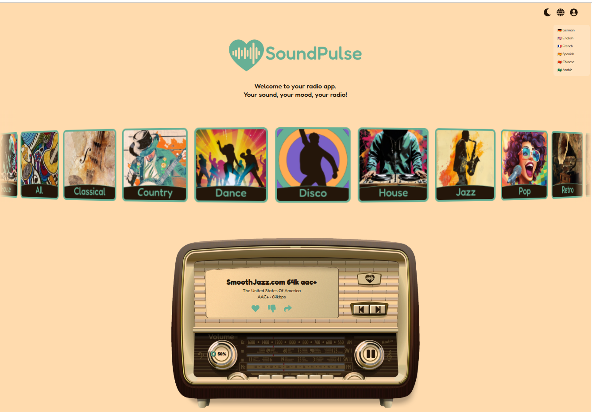
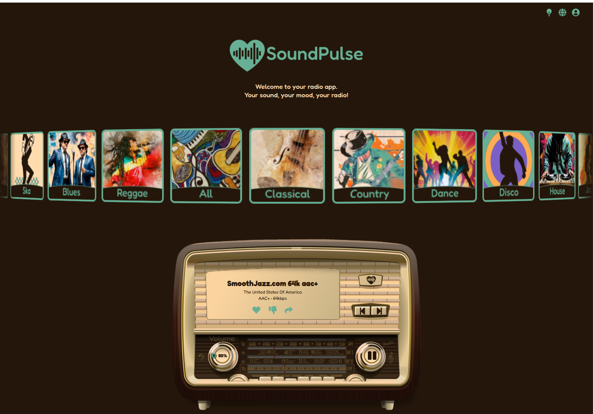

## Learning Project - 🎵 SoundPulse

Created in KaRoBo team - [Natallia-Karatava](https://github.com/Natallia-Karatava), [marrozhkova](https://github.com/marrozhkova), [Grafikmartin](https://github.com/Grafikmartin)


A sleek, responsive **online radio application** designed with a modern interface and fluid user experience. SoundPulse is a front-end focused SPA that delivers a visual and auditory exploration of music with an elegant layout.

🔗 **Live demo**: [https://sound-pulse.vercel.app/](https://sound-pulse.vercel.app/)

---

## ✨ Features

- 🎧 Visually appealing online radio mockup
- 💡 Fully responsive, mobile-first design
- 🎨 Inspired by minimalism and soft UI/UX transitions
- ⚡ Fast loading (deployed with Vercel)

---

## 🎯 Purpose
This project demonstrates modern front-end layout design and responsive styling. It serves as a foundation for future music-related applications or web-based audio interfaces.

---

## 🧑‍💻 Tech Stack

- **HTML**
- **CSS (Custom)** — no framework, handcrafted layout
- **JavaScript**
- **React** (Functional Components)
- **Vercel** for deployment

---

## 📸 Screenshots

| Light mode | Dark mode |
|-----------|-------------|
|  |  |

---

## 🛠️ Setup & Run Locally

```bash
git clone https://github.com/marrozhkova/SoundPulse.git
cd SoundPulse
npm install
npm run dev
```
## 👤 About me

**Maryna Rozhkova**  
Frontend Developer | Learner by Heart  
📫 [mar.rozhkova@gmail.com](mailto:mar.rozhkova@gmail.com)  
🌐 [Portfolio](https://marrozhkova-portfolio.vercel.app/)
